# Certified Appsec Practitioner (CAP) learning

- [Certified Appsec Practitioner (CAP) learning](#certified-appsec-practitioner-cap-learning)
  - [Understanding of OWASP Top 10 Vulnerabilities](#understanding-of-owasp-top-10-vulnerabilities)
- [A01:2021 - Broken Access Control](#a012021---broken-access-control)
  - [Authorization and Session Management related flaws](#authorization-and-session-management-related-flaws)
    - [Detección](#detección)
    - [Recomendaciones](#recomendaciones)
    - [Ataques relacionados con fallos de autenticación y autorización](#ataques-relacionados-con-fallos-de-autenticación-y-autorización)
      - [Insecure Direct Object Reference (IDOR)](#insecure-direct-object-reference-idor)
      - [Privilege Escalation](#privilege-escalation)
      - [Parameter Manipulation attacks](#parameter-manipulation-attacks)
      - [Securing Cookies (Session Hijaking)](#securing-cookies-session-hijaking)
    - [Referencias](#referencias)
- [A02:2021 - Cryptographic failures](#a022021---cryptographic-failures)
  - [Encoding, Encryption and Hashing](#encoding-encryption-and-hashing)
    - [Codificación](#codificación)
      - [ASCII](#ascii)
      - [ISO-8859](#iso-8859)
      - [Unicode](#unicode)
    - [Cifrado](#cifrado)
    - [Hashing](#hashing)
    - [Referencias](#referencias-1)
  - [TLS security](#tls-security)
    - [TLS Certificate Misconfiguration](#tls-certificate-misconfiguration)
      - [Deshabilitar versiones de SSL y TLS antiguas](#deshabilitar-versiones-de-ssl-y-tls-antiguas)
      - [Uso de una suite de cifrado correcta](#uso-de-una-suite-de-cifrado-correcta)
      - [Tamaño de la clave privada RSA](#tamaño-de-la-clave-privada-rsa)
      - [Firma del certificado](#firma-del-certificado)
      - [HSTS](#hsts)
    - [Symmetric and Asymmetric Ciphers](#symmetric-and-asymmetric-ciphers)
      - [Cifrado simétrico](#cifrado-simétrico)
      - [Cifrado asimétrico](#cifrado-asimétrico)
    - [Referencias](#referencias-2)
- [A03:2021 - Injection](#a032021---injection)
  - [Input Validation Mechanisms](#input-validation-mechanisms)
    - [Validación de entradas de texto](#validación-de-entradas-de-texto)
      - [Procedimiento](#procedimiento)
      - [Blacklisting / Block list](#blacklisting--block-list)
      - [Whitelisting / Allow list](#whitelisting--allow-list)
      - [Validación de texto Unicode de forma libre](#validación-de-texto-unicode-de-forma-libre)
      - [Expresiones regulares](#expresiones-regulares)
      - [Uso de validadores en programación](#uso-de-validadores-en-programación)
    - [Validación de ficheros de entrada](#validación-de-ficheros-de-entrada)
      - [Carga del fichero](#carga-del-fichero)
      - [Almacenamiento del fichero](#almacenamiento-del-fichero)
      - [Procesamiento de un fichero subido](#procesamiento-de-un-fichero-subido)
    - [References](#references)
  - [Cross-Site Scripting](#cross-site-scripting)
    - [Tipos de XSS](#tipos-de-xss)
      - [Reflejado](#reflejado)
      - [Almacenado](#almacenado)
      - [Basado en DOM](#basado-en-dom)
    - [Detección](#detección-1)
    - [Ejemplo de código vulnerable](#ejemplo-de-código-vulnerable)
    - [Prevención](#prevención)
      - [Content Security Policy (CSP)](#content-security-policy-csp)
      - [Cabecera X-XSS-Protection](#cabecera-x-xss-protection)
    - [Referencias](#referencias-3)
  - [SQL Injection](#sql-injection)
    - [Tipos de SQLi](#tipos-de-sqli)
    - [Detección](#detección-2)
    - [Ejemplo de código vulnerable](#ejemplo-de-código-vulnerable-1)
    - [Prevención](#prevención-1)
    - [Referencias](#referencias-4)
  - [Otras vulnerabilidades de inyección](#otras-vulnerabilidades-de-inyección)
- [A04:2021 - Insecure design](#a042021---insecure-design)
    - [Prevención](#prevención-2)
- [A05:2021 - Security Misconfigurations](#a052021---security-misconfigurations)
  - [Security Best Practices and Hardening Mechanisms.](#security-best-practices-and-hardening-mechanisms)
    - [Same Origin Policy](#same-origin-policy)
      - [CORS  (Cross-Origin Resource Sharing)](#cors--cross-origin-resource-sharing)
    - [Security Headers](#security-headers)
    - [Referencias](#referencias-5)
- [A06:2021 - Vulnerable and Outdated Components](#a062021---vulnerable-and-outdated-components)
    - [Prevención](#prevención-3)
- [A07:2021 - Identification and Authentication Failures](#a072021---identification-and-authentication-failures)
  - [Authentication related Vulnerabilities](#authentication-related-vulnerabilities)
    - [Brute force Attacks](#brute-force-attacks)
      - [Prevención](#prevención-4)
    - [Password Storage and Password Policy](#password-storage-and-password-policy)
      - [Password Storage (Almacenamiento de Contraseñas)](#password-storage-almacenamiento-de-contraseñas)
        - [Prevención](#prevención-5)
      - [Password Policy (Política de Contraseñas)](#password-policy-política-de-contraseñas)
- [A08:2021 - Software and Data Integrity Failures](#a082021---software-and-data-integrity-failures)
    - [Prevención](#prevención-6)
- [A09:2021 – Security Logging and Monitoring Failures](#a092021--security-logging-and-monitoring-failures)
    - [Prevención](#prevención-7)
- [A10:2021 – Server-Side Request Forgery (SSRF)](#a102021--server-side-request-forgery-ssrf)
  - [Server-Side Request Forgery](#server-side-request-forgery)
    - [Ejemplo de código vulnerable](#ejemplo-de-código-vulnerable-2)
    - [Prevención](#prevención-8)
    - [Referencias](#referencias-6)
- [Otras categorias importantes](#otras-categorias-importantes)
  - [Cross-Site Request Forgery](#cross-site-request-forgery)
    - [Detección](#detección-3)
    - [Ejemplo de código vulnerable](#ejemplo-de-código-vulnerable-3)
    - [Prevención](#prevención-9)
      - [Tokens anti-CSRF](#tokens-anti-csrf)
      - [Cookies Strict SameSite](#cookies-strict-samesite)
    - [Referencias](#referencias-7)
  - [XML External Entity attack](#xml-external-entity-attack)
    - [Detección](#detección-4)
    - [Ejemplo de código vulnerable](#ejemplo-de-código-vulnerable-4)
    - [Prevención](#prevención-10)
    - [Referencias](#referencias-8)
  - [Insecure File Uploads (Local File Inclusion \& Path Traversal)](#insecure-file-uploads-local-file-inclusion--path-traversal)
    - [Detección](#detección-5)
    - [Protecciones débiles](#protecciones-débiles)
      - [Listas negras de extensiones](#listas-negras-de-extensiones)
      - [Listas blancas de extensiones](#listas-blancas-de-extensiones)
      - [Validación de la cabecera Content-Type](#validación-de-la-cabecera-content-type)
      - [Usar un detector de tipo de archivo](#usar-un-detector-de-tipo-de-archivo)
    - [Ejemplo de código vulnerable](#ejemplo-de-código-vulnerable-5)
    - [Recomendación](#recomendación)
      - [Cabecera X-Content-Type-Options](#cabecera-x-content-type-options)
    - [Referencias](#referencias-9)

## Understanding of OWASP Top 10 Vulnerabilities

El OWASP Top 10 de vulnerabilidades de 2021 ha sido el siguiente:

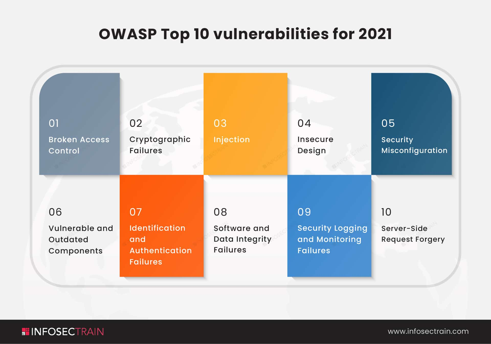

# A01:2021 - Broken Access Control

## Authorization and Session Management related flaws

Las vulnerabilidades relacionadas con la autenticación y gestión de sesiones permiten a un atacante poder tener acceso a un sistema o aplicación sin tener una cuenta valida para hacerlo.

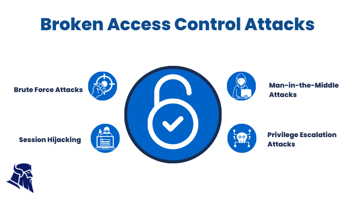

### Detección

Puede haber debilidades de autenticación si la aplicación:
* Permite ataques automatizados como el relleno de credenciales, donde el atacante tiene una lista de nombres de usuario y contraseñas válidas.
* Permite la fuerza bruta u otros ataques automatizados.
* Permite contraseñas predeterminadas, débiles o conocidas, como "password" o "admin/admin".
* Utiliza una recuperación de credencial débil o ineficaz, tales como respuestas basadas en el conocimiento, que no se pueden hacer seguras.
* Usa contraseñas en texto plano o débilmente cifrada.
* No existe autenticación multifactor o está débilmente implementado.
* Expone los identificaciones de sesión en la URL.
* No rota el ID de sesión después de un inicio de sesión exitoso.
* No invalida correctamente las identificaciones de sesión. Las sesiones de los usuarios o los tokens de autenticación (particularmente los tokens de inicio de sesión (SSO)) no están debidamente invalidados durante el logout o un período de inactividad.

Para detectar vulnerabilidades en la autenticación podemos hacer uso de herramientas como:
* ZAP o BurpSuite: proxies que permiten analizar las solicitudes y respuestas HTTP, cookies de sesión, parametros, campos ocultos...
* Hydra, Ncrack o Medusa: probar ataques de fuerza bruta o de diccionarios
* Cookie Cadger: interceptar, manipular o capturar los identificadores de sesión, como cookies de sesión.

### Recomendaciones

* Siempre que sea posible, implementar autenticación multifactor para prevenir ataques automatizados, como fuerza bruta o reutilización de credenciales robadas.
* Mantener una gestión segura de secretos, particularmente para los usuarios de administración.
* Implemente comprobaciones de contraseñas débiles, como probar contraseñas nuevas o cambiadas contra una lista de las 10000 peores contraseñas.
* Alinear la longitud de la contraseña, la complejidad y las políticas de rotación con las directrices de NIST.
* Asegúrese de que las vías de registro, recuperación de credenciales y API se aseguran contra los ataques de enumeración de cuentas mediante el uso de los mismos mensajes para todos los resultados.
* Límite o retraso de intentos de inicio de sesión fallidos. Registrar todos los fallos y alertar a los administradores cuando se detectan relleno de credenciales, fuerza bruta u otros ataques.
* Utilice un gestor de sesión del lado del servidor, seguro y integrado que genere un nuevo ID de sesión aleatorio con alta entropía después de login. Las identificaciones de sesión no deben estar en la URL, almacenarse de forma segura e invalidar después de logout.

### Ataques relacionados con fallos de autenticación y autorización

#### Insecure Direct Object Reference (IDOR)

**Insecure direct object reference (IDOR)** es un ataque utilizado por los atacantes que permite el acceso a datos o recursos que deberían de permanecer ocultos para el usuario.

IDOR es una vulnerabilidad que se produce cuando la aplicación web no comprueba correctamente la autorización a un recurso protegido.

Los ataques de IDOR se pueden desglosar en tres tipos distintos:
* Uso de un identificador débil: Una aplicacion usa identificadores débiles y previsibles, como números secuenciales, para acceder a un recurso.
* Asignación de permisos incorrectos: Una aplicación asigna los permisos incorrectos a un usuario, el cual no está autorizado a acceder. 
* Control de acceso inadecuado: Una aplicación no comprueba la identidad del usuario antes de permitir el acceso a un recurso.

> [!NOTE]
> Un ejemplo sería si una aplicación usa un identificador numérico predecible para el usuario para acceder a su cuenta bancaria, lo cual permite a otro usuario manipular la URL y acceder a otra cuenta que no es suya.

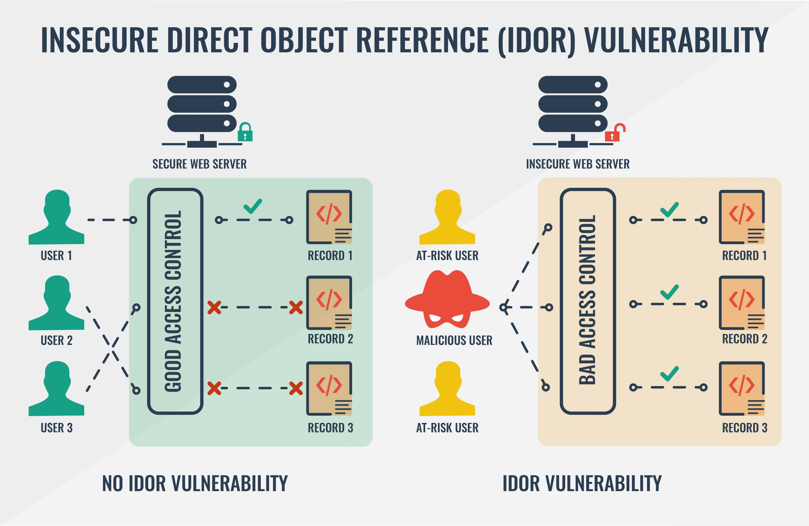

Para mitigar un IDOR se recomienda:
* Usar un identificador robusto: los identificadores deben de ser fuertes y dificiles de adivinar, con caracteres aleatorios y no secuenciales.
* Asignación de permisos correcta: los permisos del usuario están correctamente otorgados.
* Implementar controles de acceso robustos: se debe de garantizar que los usuarios solo puedan acceder a los recursos que deben de acceder.
* Aplicar políticas de seguridad en las entradas: validar las entradas de usuarios y garantizar que la aplicación compruebe correctamente la referencia al objeto.

#### Privilege Escalation

La **escalada de privilegios** es el proceso por el que se explota una vulnerabilidad de un sistema con el objetivo de obtener un mayor nivel de permisos en el mismo para una cuenta de un usuario existente. Para hacer esto se pueden usar diferentes métodos, desde usar una puerta trasera, aprovechar un error del sistema o atacando una contraseña débil del administrador.

Existen principalmente 2 métodos de escalada de privilegios:
* Vertical: un usuario con privilegios limitados puede acceder a privilegios más altos de lo que realmente tiene permitido. P.e: un empleado con acceso a datos confidenciales puede usar ese acceso para obtener los mismos privilegios que un empleado de nivel superior, como un gerente.
* Horizontal: un usuario con un conjunto de privilegios es capaz de acceder a otros privilegios de otro usuario. P.e: un empleado de bajo nivel puede explotar una vulnerabilidad en el sistema para obtener privilegios administrativos.

Tipos comunes de técnicas o métodos de escalada de privilegios:
* Uso de ingeniería social.
* Ataques pass-the-hash o rainbow tables: tiene como objetivo hacerse pasar por un usuario mediante el uso de un hash de contraseña robado para crear una nueva sesión.
* Vulnerabilidades: explotación de vulnerabilidades en el software y los sistemas operativos
* Configuraciones incorrectas: contraseñas débiles, servicios de red no seguros, puertos abiertos, fallas auténticas y otros sistemas mal configurados.
* Exploits de kernel: en esta técnica, el atacante explota vulnerabilidades de día cero en el kernel del sistema operativo para escalar sus privilegios.

Para mitigar la escalada de privilegios se recomienda:
* Implementar protocolos de autenticación y autorización fuertes
* Mantener el sistema actualizado con los últimos parches de seguridad y correctamente configurado
* Reducir el acceso físico al sistema
* Utilizar el mínimo privilegio

#### Parameter Manipulation attacks

Los **ataques de manipulación de parámetros** son un conjunto de vulnerabilidades web que modifican el comportamiento normal de la aplicación debido al uso de datos no esperados en ciertos parámetros de la URL.

Existen varios ataques de manipulación de parámetros, donde destacan el SQL injection o el XSS. Aún así, existen muchos otros tal vez menos conocidos pero muy relevantes:

* **LDAP injection**: un atacante inserta comandos maliciosos en consultas LDAP (Lightweight Directory Access Protocol) para comprometer la integridad de la base de datos o acceder a información no autorizada. Al explotar fallos en la validación de datos de entrada, el atacante puede manipular las consultas LDAP y realizar acciones no permitidas. Para prevenirlo, es esencial validar y filtrar adecuadamente las entradas del usuario, utilizando funciones de escape o parámetros preparados para evitar la ejecución no deseada de comandos LDAP. Además, se recomienda implementar políticas de seguridad robustas y actualizaciones regulares del software.
* **HTML injection o Code injection**: un atacante inserta código malicioso en una aplicación para ejecutar operaciones no autorizadas. En "Code injection," se manipulan lenguajes de programación, como Python o JavaScript, para ejecutar comandos indeseados. Para prevenirlo, se deben validar y limpiar las entradas del usuario, y utilizar funciones de escape adecuadas. En "HTML injection," los atacantes insertan código HTML no seguro, pudiendo robar datos o realizar acciones no autorizadas en el navegador del usuario. Para prevenirlo, se debe validar y escapar correctamente las entradas, y preferir el uso de funciones seguras, como `htmlspecialchars` en PHP.
* **Buffer overflow**:  un atacante manipula un programa para escribir datos más allá del límite asignado a un búfer en la memoria, lo que puede resultar en la ejecución de código no autorizado. Esto puede llevar a un control total del sistema. Para prevenirlo, es fundamental validar y limitar la entrada de datos, utilizar funciones seguras e implementar medidas de protección de memoria.
* **Session Hijacking:** un atacante consigue la información de sesión de un usuario para acceder no autorizadamente a una cuenta. Esto puede ocurrir mediante el uso de técnicas como el "session sniffing" o el robo de cookies. Para prevenirlo, es crucial utilizar conexiones seguras mediante el protocolo HTTPS, implementar cookies seguras y `httponly`, y renovar las sesiones periódicamente. Además, se recomienda educar a los usuarios sobre prácticas seguras de autenticación, como cerrar sesión después de su uso y evitar conexiones a redes Wi-Fi públicas no seguras.
* **Directory Path Traversal:** un atacante aprovecha la falta de restricciones en la manipulación de rutas de directorios para acceder a archivos o directorios fuera del alcance previsto. Esto puede llevar a la revelación no autorizada de datos sensibles o ejecución de código malicioso. Para prevenirlo, se deben validar y limpiar cuidadosamente las entradas del usuario, limitar el acceso a rutas específicas, y utilizar listas blancas en lugar de listas negras para permitir solo las rutas conocidas y seguras. Implementar permisos adecuados también es esencial para limitar accesos no autorizados.

#### Securing Cookies (Session Hijaking)

Las cookies son el punto débil del usuario, ya que es donde se almacena en muchos casos información sensible que la aplicación necesita que el cliente mantenga en su entorno.

Uno de los tipos de cookies más sensibles son las **cookies de sesión**, que son las que permiten mantener la sesión iniciada con una aplicación en un periodo de tiempo.

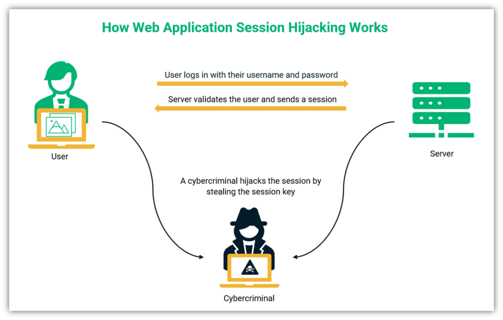

Ciertas medidas relevantes para mantener seguras las cookies son:
* Cifrar las cookies, evitando que los atacantes tengan acceso a las mismas
* Mantener una expiración adecuada de la cookie, no demasiado larga
* Evitar los ataques de XSS via cabecera CSP y sanitización de código

Además de las medidas anteriores, es necesario establecer una buena configuración de las cookies:

* Configura tus cookies con las opciones `Secure` y `HttpOnly`.
  * **Secure**: Garantiza que las cookies solo se envíen a través de conexiones seguras (HTTPS)
  * **HttpOnly**: Evita que las cookies sean accesibles a través de scripts del lado del cliente, lo que reduce el riesgo de ataques XSS.
* Usa el atributo `SameSite` para evitar ataques de solicitud entre sitios (CSRF)
  * **SameSite=Strict**: La cookie solo se enviará en una solicitud si la solicitud proviene del mismo sitio que la página de destino.

```http
Set-Cookie: nombreCookie=valorCookie; Secure; HttpOnly; SameSite=Strict; Expires=Sun, 31 Jan 2024 23:59:59 GMT
```

### Referencias

[A2:2017-Broken Authentication](https://owasp.org/www-project-top-ten/2017/A2_2017-Broken_Authentication)

[¿Cómo se prueba la autenticación rota y la administración de sesiones en aplicaciones web?](https://www.linkedin.com/advice/1/how-do-you-test-broken-authentication-session)

# A02:2021 - Cryptographic failures

## Encoding, Encryption and Hashing

### Codificación

La codificación de caracteres (character encoding) es el método que permite convertir un carácter de un lenguaje natural (alfabeto) en un símbolo de otro sistema de representación, como un número, un símbolo o una secuencia de pulsos eléctricos en un sistema electrónico, aplicando una serie de normas o reglas de codificación.

> [!IMPORTANT]
> La codificación en si **no implica seguridad**, simplemente permite definir tablas que indiquen el carácter en el lenguaje natural y su correspondencia en el lenguaje del sistema informático.

#### ASCII

El conjunto de caracteres ASCII publicado por el ANSI (American National Standard Code for Information Interchange) como estándar en 1967.

Se diseñó en un principio utilizando solamente 7 bits, para dejar el octavo bit para la paridad (control de errores), por lo que solamente puede representar 128 caracteres, suficientes para incluir mayúsculas y minúsculas del abecedario inglés, además de cifras, puntuación y algunos caracteres de control.

#### ISO-8859

La norma **ISO-8859 (o ASCII extendido)** utiliza 8 bits y, por tanto, permite 256 caracteres. Estos son suficientes para abarcar los caracteres de un lenguaje en concreto.

En ellos, los primeros 128 caracteres son los mismos de la tabla ASCII original y los 128 siguientes se corresponden a símbolos extra añadidos.

Sin embargo, 8 bits siguen siendo insuficientes para codificar todos los alfabetos conocidos, por lo que cada zona tiene que usar su propia especialización de la norma ISO 8859. El alfabeto español es el "ISO 8859-1 (Latin-1) Europa occidental".

#### Unicode

Como solución a los problemas de que ningún conjunto de caracteres recogía todos los lenguajes mundiales, desde 1991 se ha acordado internacionalmente crear y utilizar la norma Unicode. 

Unicode asigna un código a cada uno de los más de cincuenta mil símbolos que posee, los cuales abarcan todos los alfabetos europeos, ideogramas chinos, japoneses, coreanos, muchas otras formas de escritura, lenguas muertas y más de un millar de símbolos especiales.

Son tres las formas de codificación bajo el nombre UTF:
* UTF-8 Codificación orientada a byte con símbolos de longitud variable. La más utilizada pero la más complicada para el ordenador.
* UTF-16 Codificación de 16 bits de longitud variable optimizada para la representación del plano básico multilingüe (BMP).
* UTF-32 Codificación de 32 bits de longitud fija, y la más sencilla de las tres.

### Cifrado

El cifrado es un método de protección que consiste en alterar los datos de un mensaje hasta hacerlos ilegibles. La idea es que un emisor cifre el mensaje y que solo pueda ser descifrado por el receptor, usando la misma clave (cifrado simétrico) o usando otra (cifrado asimétrico).

Ver [Symmetric and Asymmetric Ciphers](#symmetric-and-asymmetric-ciphers)

### Hashing

El **hashing** es el proceso de convertir una entrada de longitud variable en una salida de longitud fija, generalmente para propósitos de autenticación y seguridad de datos. Este proceso se realiza mediante una **función hash**, que crea un valor único, también conocido como hash, para cada entrada única, incluso si la diferencia es mínima.

Los principios del hashing son:
* **Determinismo**: La misma entrada siempre producirá el mismo hash.
* **Repidez**: La función hash debe ser capaz de producir el hash en un tiempo relativamente corto.
* **Irreversible**: Debería ser computacionalmente inviable generar la entrada original a partir de su hash
* **Impredecible**: Un cambio mínimo en la entrada debería cambiar drásticamente el hash.
* **Resistencia a colisiones**: Debería ser extremadamente difícil encontrar dos entradas diferentes que produzcan el mismo hash.

> [!IMPORTANT]
> Dados todos estos principios, especialmente _irreversible_, podemos encontrar la gran diferencia con el cifrado. El cifrado busca que el mensaje sea ilegible por todo el mundo a excepción del propietario de la clave, que podría descifrarlo. En las funciones hash, no debería ser posible llegar desde un mensaje hasheado al original.

El hashing es ampliamente usado para verificar la integridad de recursos en el momento de transmisión de datos, almacenar contraseñas de forma segura, incrementar velocidades en las búsquedas y verificar las firmas digitales.


Existen múltiples funciones hash, aunque las mas populares son:
* **MD5 (Message-Digest Algorithm 5)**: es una función hash ampliamente utilizada que produce un valor hash de 128 bits. Aunque ha sido atacada y ya no se considera segura para su uso en aplicaciones de seguridad, sigue siendo ampliamente utilizada para fines de integridad de datos.
* **SHA-1 (Secure Hash Algorithm 1)**: es una función hash de 160 bits que se utiliza ampliamente para verificar la integridad de los datos. Dado que se ha demostrado que es vulnerable a ataques de colisión, es insegura y no recomendada.
* **SHA-2**: es una familia de funciones hash que incluye a SHA-224, SHA-256, SHA-384 y SHA-512. Estas funciones hash producen valores hash de 224, 256, 384 y 512 bits, respectivamente. Se consideran más seguras que MD5 y SHA-1 y se utilizan ampliamente en aplicaciones de seguridad.
* **SHA-3**: es una familia de funciones hash creada como una alternativa a SHA-2. Incluye a SHA3-224, SHA3-256, SHA3-384, SHA3-512, SHAKE128 y SHAKE256. Estas funciones hash producen valores hash de diferentes longitudes y se consideran muy seguras

### Referencias

[Qué es la Codificación de Caracteres](https://www.ticarte.com/contenido/que-es-la-codificacion-de-caracteres)

[Sobre el Hashing](https://www.hostingtg.com/blog/que-es-el-hashing/)

## TLS security

**Transport Layer Security (TLS)** es un protocolo criptográfico diseñado para proporcionar una conexión cifrada entre dos puntos, tradicionalmente un cliente y un servidor. El TLS se utiliza para asegurar la comunicación entre el navegador y el servidor, comunicaciones de correo electrónico, redes privadas virtuales (VPN), transferencias de archivos...

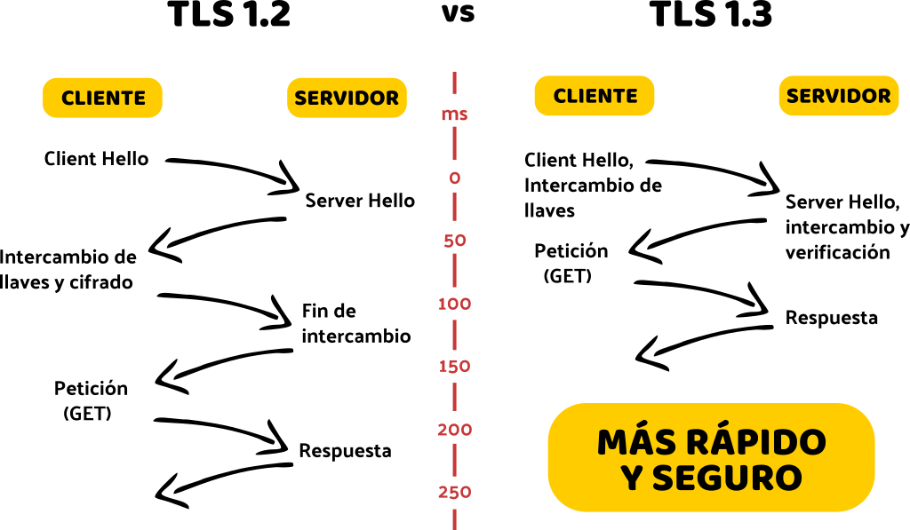

Actualmente la versión de TLS más usada es TLS 1.2, aunque gradualmente se está implantando la versión de TLS 1.3, con cifrado asimétrico.

### TLS Certificate Misconfiguration

#### Deshabilitar versiones de SSL y TLS antiguas

Dado que SSL/TLS son unos mecanismos de cifrado y que los recursos dentro de la computación avanzan cada día mas, es necesario mantener una versión de SSL/TLS segura que permita que la información cifrada entre el cliente y el servidor no pueda ser descifrada.

Actualmente las versiones SSL 2.0 y 3.0 y TLS 1.0 y 1.1 ya no son seguras. Estas usaban cifrados simétricos para cifrar la conexión, por lo que podrían ser atacadas a través de ataques MITM, interceptando las comunicaciones. Además, estas no permitían el uso de protocolos de autenticación modernos, como curvas elípticas. Dado este motivo, el uso de versiones poco seguras permite que un atacante pueda descifrar la conexión entre el servidor y los clientes, obteniendo información personal y/o confidencial. 

La recomendación es el **uso de TLS 1.2 o superior**.

#### Uso de una suite de cifrado correcta

El uso de un método criptográfico correcto en el cifrado es básico. En el momento de la negociación de la comunicación, el navegador web envía una lista de suites de cifrado de su preferencia y el servidor le responde con la seleccionada para mantener la comunicación. Es en ese momento donde el servidor debe elegir una de las suites de cifrado más robustas que el navegador acepte. 

El método más robusto a día de hoy es el uso de **curvas elípticas o Elliptic Curve Diffie–Hellman (ECDH)**. 

#### Tamaño de la clave privada RSA

A la hora de generar tu par de claves (clave privada y clave pública) con la que se generará el certificado de tu web, el tamaño de la clave RSA debe de ser de **al menos 2048 bits**. Actualmente la versión de 1024 bits es insegura.

Al igual que para la clave RSA, el parámetro DH (DHE_RSA) también debe establecerse a 2048.

#### Firma del certificado

La firma del certificado debe realizarse usando una función hash segura. Lo mínimo recomendable está en **SHA-256**.

#### HSTS

**HTTP Strict-Transport-Security (HSTS)** es una característica de seguridad que permite a un sitio web indicar a los navegadores que sólo se debe comunicar con HTTPS en lugar de usar HTTP.

Si un sitio web acepta una conexión a través de HTTP y redirecciona a HTTPS, el usuario en este caso podría inicialmente hablar a la versión no encriptada del sitio antes de ser redireccionado. Esto habilita el potencial ataque man-in-the-middle, donde el redireccionamiento podría ser aprovechado para enviar al usuario a un sitio malicioso en lugar de la versión segura.

El encabezado `HTTP Strict Transport Security` permite a un sitio web informar al navegador que nunca cargue el sitio usando HTTP y que debe automáticamente convertir todos los intentos de acceso HTTP a HTTPS.

```
Strict-Transport-Security: max-age=<expire-time>
```

El parámetro max-age es el tiempo, en segundos, sobre el cual el navegador recuerda que solo es accesible via HTTPS. En cualquier momento que el encabezado Strict-Transport-Security sea entregado el navegador, este actualiza el tiempo de expiración para el sitio, así los sitios pueden refrescar su información y prevenir el tiempo de expiración.

### Symmetric and Asymmetric Ciphers

#### Cifrado simétrico

El **cifrado simétrico** es un paradigma criptográfico donde una única clave es utilizada tanto para cifrar como para descifrar datos. Este método se caracteriza por su eficiencia en términos de velocidad y recursos computacionales, ya que la misma clave se aplica en ambas direcciones del proceso criptográfico.

La confidencialidad de la información se basa en la premisa de que las entidades comunicantes comparten de **manera segura esta clave**, permitiendo que solo ellas puedan acceder a la información cifrada.

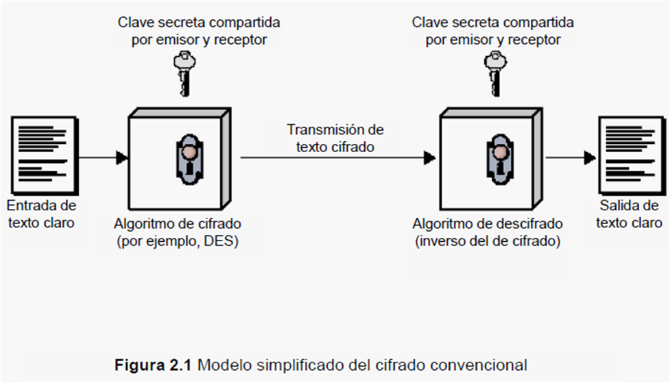

Existen 2 tipos de cifrados simétricos:
* Cifrados de bloque: Los datos de entrada se dividen en bloques de un tamaño específico, de 64 o 128 bits. La operación de cifrado se realiza mediante una función matemática que involucra tanto los datos del bloque como una clave secreta, donde cada bloque depende del anterior, creando una cadena.
* Cifrados de flujo: Los datos de entrada se cifran de manera continua, bit a bit o byte a byte, a medida que se transmiten. Esta secuencia se combina con los datos originales mediante una operación lógica (como XOR) para producir la salida cifrada.

Como ejemplos de cifrados simétricos:
* **AES (Advanced Encryption Standard):** Es un método de cifrado simétrico ampliamente adoptado y vigente, tanto por su eficacia como por su seguridad comprobada. Pese a ser el mas utilizado, es importante que sea usado en el modo CTR, que es el más seguro. Uso de otros modos, especialmente ECB o CBC, hacen que el algoritmo no sea seguro.
* **DES (Data Encryption Standard):** Aunque ahora es considerado inseguro debido a su corta longitud de clave, fue uno de los primeros estándares de cifrado.
* **3DES (Triple DES):** Una mejora de DES que aplica el algoritmo DES tres veces en cada bloque de datos. Aunque más seguro que DES, AES es preferido en la actualidad.
* **Blowfish**: Diseñado con énfasis en la velocidad y eficiencia, Blowfish utiliza bloques de datos de 64 bits y es adecuado para una variedad de aplicaciones.
* **RC4**: Aunque inicialmente diseñado para el cifrado de flujo, también se ha utilizado como cifrado simétrico de bloque. Sin embargo, su seguridad ha sido cuestionada en los últimos años.
  
#### Cifrado asimétrico

El **cifrado asimétrico** es un enfoque de cifrado que utiliza dos claves distintas usadas para descifrar y cifrar: **clave privada y clave pública**.

En el cifrado asimétrico, la seguridad se basa en la complejidad matemática de ciertos algoritmos. Cuando alguien quiere enviar información de forma segura a otra persona, utiliza la clave pública del destinatario para cifrar los datos. Una vez que los datos están cifrados con la clave pública, solo la clave privada correspondiente del destinatario puede descifrarlos.

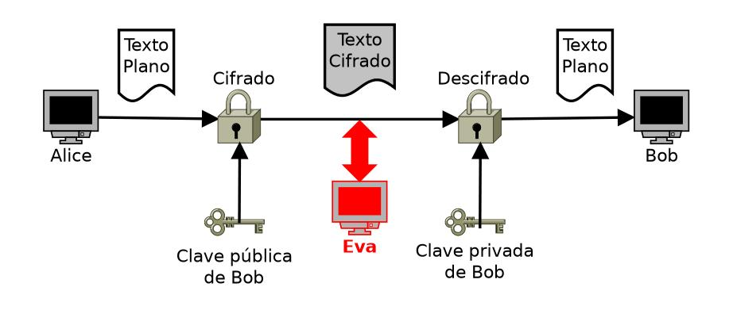

Un beneficio clave es que la clave pública puede ser compartida abiertamente sin comprometer la seguridad del sistema, ya que solo la clave privada asociada puede realizar el proceso inverso de descifrado, que es la que debe mantenerse en secreto.

Aunque más lento y menos eficiente que el simétrico, este modelo de cifrado permite separar las claves, verificar autenticidad...

Como ejemplos de cifrados asimétricos:
* **RSA (Rivest, Shamir y Adleman):** Utiliza claves pública y privada para cifrar y descifrar. Su seguridad se basa en la dificultad de factorizar grandes números primos. Es el más usado y reconocido.
* **ECC (Criptografía de Curva Elíptica):** Emplea propiedades matemáticas de curvas elípticas para cifrar y firmar digitalmente. Ofrece una gran seguridad con claves más cortas que otros métodos.
* **Protocolo Criptográfico Diffie-Hellman:** Aunque es más comúnmente conocido como un protocolo de intercambio de claves, también puede considerarse un método de cifrado asimétrico. Permite a las dos partes acordar de forma segura una clave secreta compartida.
* **PGP**: Utiliza un sistema híbrido que combina cifrado simétrico y asimétrico. Se utiliza comúnmente para asegurar correos electrónicos y archivos.
* **DSA (Algoritmo de Firma digital):** Diseñado para firmar digitalmente información. Usa un par de claves para crear y verificar firmas digitales.

### Referencias

[Understanding SSL Misconfiguration](https://snelling.io/ssl/)

[Strict-Transport-Security](https://developer.mozilla.org/es/docs/Web/HTTP/Headers/Strict-Transport-Security)

[Cifrado simétrico: Qué es, ventajas, desventajas y cómo funciona](https://www.ceupe.com/blog/cifrado-simetrico.html?dt=1707296074970)

[Cifrado asimétrico: Qué es, ventajas, y funcionamiento](https://www.ceupe.com/blog/cifrado-asimetrico.html)

# A03:2021 - Injection

## Input Validation Mechanisms

Los **mecanismos de validación de entradas** son técnicas que permiten garantizar que las entradas proporcionadas por un usuario o un sistema están debidamente formadas, evitando que los datos mal-formados se almacenen o procesen desencadenando un mal funcionamiento en el software.

La validación de entradas debe de efectuarse **lo antes posible** en el flujo de datos del software, preferiblemente tan pronto como se reciban del exterior.

> [!IMPORTANT]
> La validación de la entrada no debe utilizarse como el método principal de prevención de XSS, SQL Injection y otros ataques, pero permite reducir el impacto considerablemente si se implementan de forma correcta. 

### Validación de entradas de texto

#### Procedimiento

La validación de la entrada debe aplicarse tanto a nivel sintáctico como semántico.

* La validación sintáctica debe hacer cumplir la sintaxis correcta: DNI, formato de fecha, formato de email...
* La validación semántica debe imponer la exactitud de sus valores en el contexto específico: fecha de inicio antes que la de fin, precio en un rango esperado, tarjeta de crédito realista...

> [!IMPORTANT]
> Los caracteres codificados han de ser también validados, filtrados y revisados.

#### Blacklisting / Block list

El **blacklisting**, lista negra o lista de bloqueo define aquella lista o conjunto de caracteres que queremos filtrar de una entrada de texto ya que pueden presentar un problema de seguridad. Por ejemplo:

- `<` y `>`, que puede permitir la inyección de scripts en JavaScript o inyección de código HTML
- `'`, que puede permitir la inyección de consultas SQL

Las listas de bloqueo son un método adecuado para prevenir la inserción de caracteres especiales, pero suele ser un método complicado de implementar y arriesgado si no se implementa correctamente el conjunto de caracteres necesario.
 
#### Whitelisting / Allow list

El **whitelisting**, lista blanca o lista de permiso define aquella lista o conjunto de caracteres sobre la cual queremos dejar pasar los caracteres, filtrando de una entrada de texto los que no pertenecen a la lista ya que pueden presentar un problema de seguridad.

Aunque es un método más sencillo que implementar que el anterior, sigue candente el riesgo de que, no implementándose de la forma correcta, pueda llegar a introducirse una entrada incorrecta.

#### Validación de texto Unicode de forma libre

Cuando el texto es un formato libre (p.e. descripción de un producto), el input es un campo difícil de validar debido al gran espacio de caracteres permitidos. En este tipo de campos, puede ser necesario el uso de caracteres potencialmente peligrosos, como `<` o `'`, por lo que una validación como las anteriores no sería válida.

Para este tipo de campos se usan principalmente 3 medios de validación:
* Normalización: La codificación se use del mismo modo en todo el texto
* allow-listing de categorías de caracteres: Unicode permite enumerar categorías como "caracteres alfanuméricos" o "decimales" que no sólo cubre el alfabeto latino sino también otros usados en todo el mundo.
* Allow-listing de caracter individual: Si es necesario permitir el apóstrofe `'` para rellenar el campo por que ha de escribirse en inglés, puede incluirse unicamente el caracter y no todos los signos de puntuación.

Así, podemos definir un campo de texto libre con los signos de puntuación `.`, `,` y `'`, y además las categorías alfa numéricas.

#### Expresiones regulares

Es uno de los principales métodos de validación sintáctica de entradas, pero es realmente peligroso a su vez.

Las expresiones regulares permiten comprobar que un campo sigue un patrón correcto a la hora de introducir los datos. Por ejemplo, validar el código postal en EEUU:

```java
private static final Pattern zipPattern = Pattern.compile("^\d{5}(-\d{4})?$");

public void doPost( HttpServletRequest request, HttpServletResponse response) {
  try {
      String zipCode = request.getParameter( "zip" );
      if ( !zipPattern.matcher( zipCode ).matches() ) {
          throw new YourValidationException( "Improper zipcode format." );
      }
      // do what you want here, after its been validated ..
  } catch(YourValidationException e ) {
      response.sendError( response.SC_BAD_REQUEST, e.getMessage() );
  }
}
```

> [!CAUTION]
> Al diseñar la expresión regular, hay que tener especial atención con los ataques de la denegación de servicio de RegEx (ReDoS). Estos ataques hacen que un programa usando una Expresión Regular mal diseñada opere muy lentamente y utilice recursos de CPU durante mucho tiempo.

#### Uso de validadores en programación

Existen múltiples librerías y métodos predefinidos en los lenguajes de programación más usados para el uso de validadores:

* Validadores de tipo de datos disponibles de forma nativa en marcos de aplicaciones web: Apache Commons Validators y Django Validators.
* Validación contra JSON Schema y XML Schema (XSD) para los datos transferidos entre el servidor y el navegador
* Conversión de tipo (por ejemplo. Integer.parseInt()en Java, int()en Python), con manejo de excepciones
* Rango de valores mínimos y máximos para los parámetros (números, strings, fechas...)
* Array de valores permitidos para pequeños conjuntos de parámetros (por ejemplo, días de la semana)
* Expresiones regulares para cualquier otro dato estructurado

### Validación de ficheros de entrada

En los ficheros subidos se ha de validar tanto la carga como el almacenamiento del mismo:

#### Carga del fichero

* Validar que el nombre cargado utilice una extensión aceptada. Si se espera una imagen, verificar que se sube con la extensión correcta (jpg, jpeg, svg, png, gif...)
* Validar y establecer un tamaño máximo de fichero
* No permitir la carga de ficheros especiales (scripts, .htaccess y .htpasswd, crossdomain.xml y clientaccesspolicy.xml...)
* Para ficheros Zip, validar el fichero antes de extraerlo.

#### Almacenamiento del fichero

* Usar un nuevo nombre de fichero a la hora de subirlo. No usar el nombre original.
* Realizar un análisis de malware una vez cargados y antes de ser almacenados.
* La ruta del archivo no se debe de especificar por parte del cliente, es decidido por el lado del servidor.
* En el caso de imágenes, usar librerias de reescritura de imágenes que eliminen contenido malicioso

#### Procesamiento de un fichero subido

* Para el caso de imágenes subidas y que vayan a ser renderizadas, se deben de servir en el formato correcto (image/jpeg, application/x-xpinstall...)

### References

[Input Validation Cheat Sheet](https://cheatsheetseries.owasp.org/cheatsheets/Input_Validation_Cheat_Sheet.html)

## Cross-Site Scripting

El **Cross-Site Scripting (XSS)** es una vulnerabilidad basada en la inyección de scripts maliciosos en un sitio web con el objetivo de que la víctima los procese y ejecute en su equipo.

Habitualmente un atacante puede mandar una URL con un payload malicioso (script) con el objetivo de robar datos del navegador de la victima, cookies de sesión, etc.

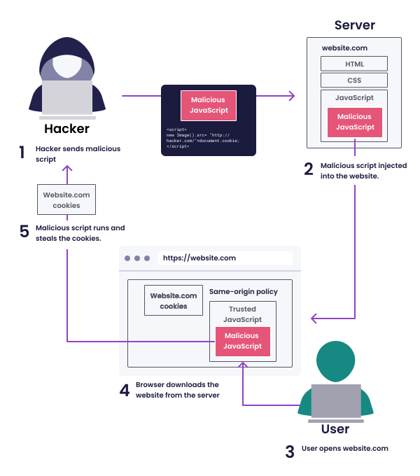

### Tipos de XSS

Existen 3 tipos de XSS: reflejado (Reflected XSS), almacenado (Stored XSS) y basado en DOM (DOM-based XSS).

#### Reflejado

El atacante inyecta el payload en un parámetro de la solicitud HTTP para que sea procesado por la aplicación y ejecutado por una víctima, a la cual se le hace llegar el enlace.

Un ejemplo práctico sería una web donde existe un parámetro de búsqueda `find` que permite encontrar en la página web cualquier término por palabras clave:

```
https://miweb.com/buscar?find=palabra_a_buscar
```

Si en lugar de poner `palabra_a_buscar` colocamos un script en JS del estilo `<script>...</script>` y este se renderiza en la web en modo script y no modo texto, la página web sería vulnerable a un XSS reflejado.

Así, un atacante podría aprovechar esta vulnerabilidad para enviar un enlace a la victima y que esta ejecutase el script que le permita obtener la información necesaria:

```
https://miweb.com/buscar?find=<script>...</script>
```

#### Almacenado

El atacante inyecta el payload a través de una de las entradas no validadas de una página web y, sin que dicha entrada sea sanitizada, se almacena en un sistema persistente (habitualmente una base de datos) que posteriormente será consultada por las víctimas.

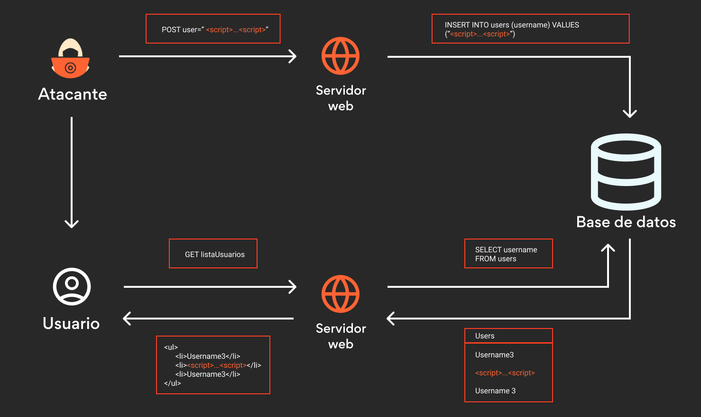

El ataque y los payloads son equivalentes que para el reflejado, pero el atacante no necesita enviar un enlace "envenenado" a la victima, si no que tan solo necesita que esta acceda a un recurso donde ya ha almacenado el script malicioso.  

#### Basado en DOM

DOM (Document Object Model) es una interfaz/API de programación que se utiliza en programación web y se utiliza principalmente para representar documentos HTML, XML, XHTML... La gran utilidad de esta interfaz es simplemente que los programas de software pueden acceder y modificar el contenido de los documentos de forma dinámica.

El XSS basado en DOM busca ejecutar un payload malicioso de tal forma que, al ejecutarlo, se pueda modificar el entorno DOM en el navegador de la víctima. Esto permite la ejecución de código remoto desde el lado de la victima.

Este tipo de vulnerabilidades vienen introducidas por muchas librerías JavaScript de fuentes no confiables desde el lado del cliente, las cuales pueden escribir en el DOM del sitio web.

También es habitual que librerías confiables usen métodos donde se cambie el entorno DOM para realizar diferentes acciones sin previa validación correcta de datos. Uno de los ejemplos característicos es `jQuery`.

El modelo de explotación realmente es equivalente al XSS reflejado, permitiendo añadir un script malicioso en las entradas a los métodos vulnerables.

### Detección

La forma de detectar una vulnerabilidad de XSS es probando las diferentes entradas de una web que permiten posteriormente renderizarse para verificar si están correctamente validadas y sanitizadas. Desde [este enlace](https://github.com/payloadbox/xss-payload-list) podéis ver una lista de payloads que permiten evaluar si las entradas permiten inyectar XSS.

Además, existen ciertas herramientas que permiten ayudar a evaluar si un sitio web es vulnerable a XSS. 

* BeEF
* BurpSuite
* ZAP
* XSS Hunter
* XSS Assistant

### Ejemplo de código vulnerable

**Java**

```java
public void recibir_entrada(String messageId, String emailSender, String messageContent) {
    database.save(messageId, emailSender, messageContent); //almacenamos la entrada sin validar en BD
}

public String renderizar_html(String messageId) {
    String messageContent = database.loadContent(messageId); //obtenemos el contenido del mensaje guardado previamente sin validar
    return String.format("<p class=\"messageContent\">%s</p>", messageContent); //renderizamos el mensaje previamente guardado y sin validar
}
```

### Prevención

Para prevenir un XSS debemos de centrarnos en detectar las entradas del usuario y no permitir que sean procesadas tal cual como han sido enviadas. 

El primer paso es detectar aquellos puntos donde recibimos un input no validado (introducido previamente por el usuario) y que luego usamos en nuestra renderización. Puede ser una entrada directamente del usuario (parámetros de búsqueda, datos de un formulario, datos de login...) o de otras fuentes (nombres de ficheros, datos en BD...). En este paso nos pueden ayudar las herramientas de análisis estático de código (SAST).

Posteriormente debemos de sanitizar la entrada, escapando caracteres especiales y caracteres codificados (por ejemplo, de nada sirve no permitir `<` si permitimos `&lt`, su codificación). Para ello existen diferentes aproximaciones, como listas blancas y negras de caracteres, pero una forma más sencilla de validar las entradas/salidas es utilizar librerías seguras y contrastadas, como `Apache Commons Text` en Java.

**Java**

```java
import static org.apache.commons.text.StringEscapeUtils.escapeHtml4;

public void recibir_entrada(String messageId, String emailSender, String messageContent) {
    database.save(messageId, emailSender, messageContent); //almacenamos la entrada sin validar en BD
}

public String renderizar_html(String messageId) {
    String messageContent = database.loadContent(messageId); //obtenemos el contenido del mensaje guardado previamente sin validar
    String escapedContent = escapeHtml4(messageContent); //validamos el contenido antes de enviarlo al cliente
    return String.format("<p class=\"messageContent\">%s</p>", escapedContent); //renderizamos el mensaje previamente guardado y VALIDADO
}
```

Finalmente, es una buena práctica y muy recomendada la validación de entradas de forma restrictiva. Según el tipo de datos, se debe de validar que el usuario está introduciendo correctamente los datos. Esto no tan solo previene de ataques de XSS, si no cualquier tipo de inyección. Por ejemplo, si estamos recibiendo un mail, el formato del mismo debe de ser `...@[dominio].com`. Para este tipo de validaciones existe la librería `Apache Commons Validator` en Java, que permite verificar muchos tipos de datos distintos.

```java
public void recibir_entrada(String messageId, String emailSender, String messageContent)
        throws Exception {

    UUID messageUUID;
    try {
        messageUUID = UUID.fromString(messageId); //comprobamos que el UUID es valido
    }
    catch (IllegalArgumentException e) {
        throw new Exception("validation of messageId parameter failed");
    }

    EmailValidator validator = EmailValidator.getInstance();
    if (!validator.isValid(emailSender)) { //comprobamos que el email es valido
        throw new Exception("validation of email parameter failed");
    }

    database.save(messageUUID, emailSender, messageContent);
}
```

#### Content Security Policy (CSP)

El CSP es una función de seguridad implementada por todos los navegadores web modernos qie permite mitigar ataques web, y en especial los XSS. Es una política que permite definir que fuentes de contenido son realmente legitimas y seguras para renderizar: scripts, imágenes, fuentes...

El objetivo de esta política es prevenir la ejecución de código no autorizado o malicioso en las páginas web, de tal forma que puede prevenir la ejecución de cualquier script malicioso, dado que no es confiable.

El Content Security Policy (CSP) se define usando ciertas directivas en la cabecera HTTP `Content-Security-Policy`, permitiendo definir que dominios tienen permitido ejecutar los recursos. Habitualmente (aunque cada caso es particular) es recomendable establecer una política que solo permita cargar los scripts desde el mismo origen o, como mucho, de algún otro origen de confianza definido.

```
Content-Security-Policy: default-src 'self' https://trusted-site.example;
```

El ejemplo anterior define que los recursos solo pueden ser cargados desde el propio origen y desde `https://trusted-site.example`. Cualquier otro origen será bloqueado.

Mas sobre como configurar [Content Security Policy (CSP)](https://developer.mozilla.org/es/docs/Web/HTTP/CSP)

#### Cabecera X-XSS-Protection

Permite habilitar o deshabilitar el filtro XSS integrado en algunos navegadores. Es recomendable tenerla activada en todo momento, ya que puede ayudar a prevenir ataques XSS.

### Referencias

[Qué es un ataque de XSS o Cross-Site Scripting - WeLiveSecurity](https://www.welivesecurity.com/la-es/2021/09/28/que-es-ataque-xss-cross-site-scripting/)

[Vulnerabilidad XSS (Cross Site Scripting): Qué es y cómo solucionarla](https://blog.hackmetrix.com/xss-cross-site-scripting/)

[DOM](https://es.wikipedia.org/wiki/Document_Object_Model)

[Cross-site scripting (XSS)](https://learn.snyk.io/lesson/xss/)

[OWASP - Testing for Stored XSS](https://owasp.org/www-project-web-security-testing-guide/latest/4-Web_Application_Security_Testing/07-Input_Validation_Testing/02-Testing_for_Stored_Cross_Site_Scripting)

## SQL Injection

El **SQL injection (SQLi)** es una vulnerabilidad web que permite a un atacante inyectar una consulta SQL maliciosa a la base de datos de una aplicación. 

El objetivo de este ataque es poder acceder a datos almacenados en una BD a los cuales el atacante no debería poder tener acceso y/o manipular o eliminar datos del origen.


Habitualmente los ataques SQLi buscan comprometer:

* Contraseñas de usuarios
* Datos financieros: tarjetas de crédito, números de cuenta
* Información personal

### Tipos de SQLi

* **Inyección SQL In-Band**: Permite obtener la información por el mismo canal que se utiliza para ejecutar el payload. Generalmente, muestra los resultados de la consulta maliciosa en la pantalla del sitio web.

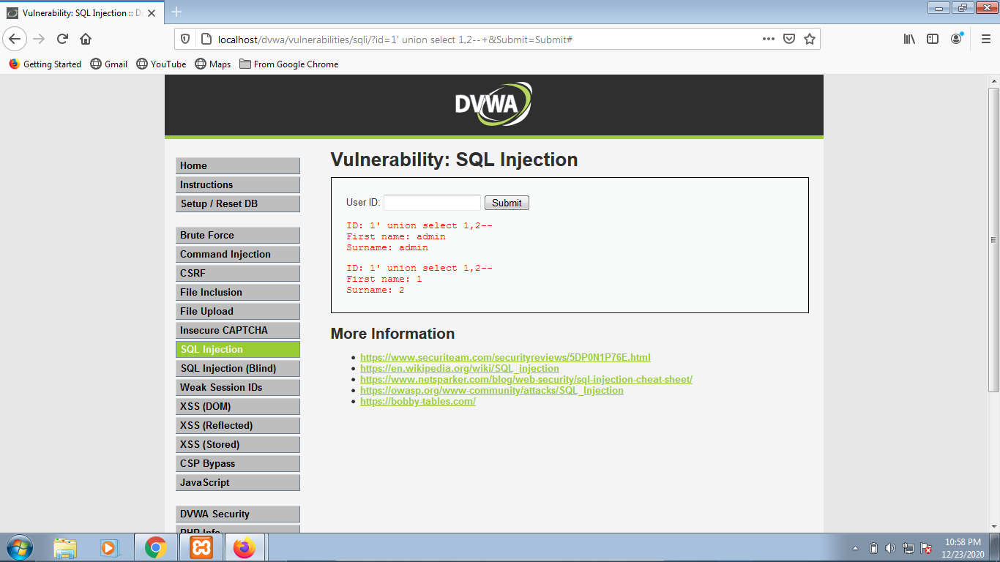

* **Inyección SQL basado en error (error-based)**: Permite extraer información de base de datos por errores inducidos en la base de datos. Habitualmente esto permite obtener información relevante de la BD, como servidor, versión, nombre de base de datos...

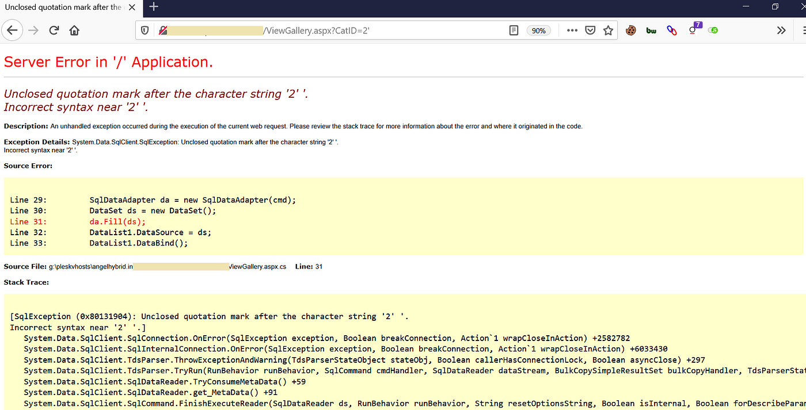

* **Inyección SQL a ciegas (blind)**: Permite obtener información de la base de datos sin ver ningún resultado, infiriendo los resultados según pruebas verdadero-falso.

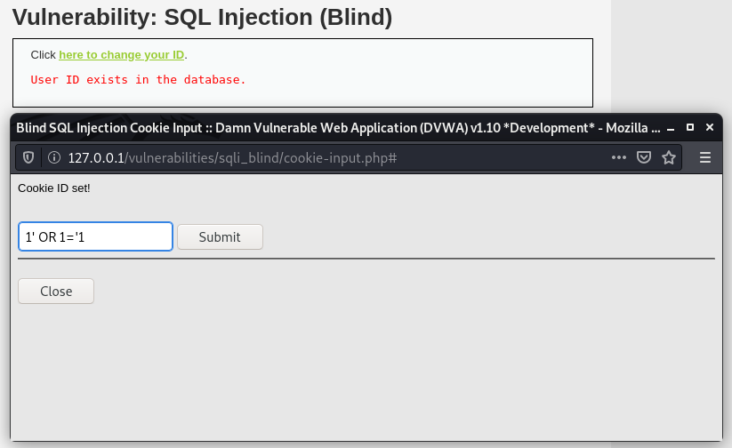

### Detección

La forma de detectar una vulnerabilidad de SQLi es probando las diferentes entradas de una web que permiten posteriormente enviarse a base de datos para verificar si están correctamente validadas y sanitizadas. Desde [este enlace](https://github.com/payloadbox/sql-injection-payload-list) podéis encontrar una lista de payloads que permiten evaluar si las entradas permiten inyectar sentencias SQL.

Además, existen ciertas herramientas que permiten ayudar a evaluar si un sitio web es vulnerable a SQLi.

* SQLmap
* jSQL Injection
* Whitewidow

### Ejemplo de código vulnerable

**Java**

```java
public static boolean comprobar_credenciales(
        HttpServletRequest req, Connection con) throws SQLException {
    //Query que busca un usuario en base de datos con las credenciales dadas
    //concatenando las entradas directamente en la consulta
    String sqlQuery = "SELECT email FROM credentials " +
            "WHERE email='" + req.getParameter("email") + "' " +
            "AND password='" + req.getParameter("password") + "'";

    Statement statement = con.createStatement();

    //Consulta la base de datos con la query vulnerable
    ResultSet rs = statement.executeQuery(sqlQuery);
    return rs.next();
}
```

Se podría explotar con el siguiente payload para saltarse la comprobación:

```sql
WHERE email='user1@startup.io'
AND password='idontknow' OR 1=1;
```

### Prevención

Para prevenir un SQLi debemos de centrarnos en detectar las entradas del usuario y no permitir que sean enviadas a base de datos antes de que sean validadas y sanitizadas. 

El primer paso es detectar aquellos puntos donde recibimos un input no validado (introducido previamente por el usuario) y que luego usamos en nuestra consulta a base de datos. En este paso nos pueden ayudar las herramientas de análisis estático de código (SAST).

Cada una de las llamadas a bases de datos SQL que incluyen algún parámetro introducido por el usuario deben de ser **parametrizadas**, y no formadas a través de concatenaciones de strings o similares. En Java existe la clase `PreparedStatement`, que proviene de `Connection`.

**Java**

```java
public static boolean comprobar_credenciales(
        HttpServletRequest req, Connection con) throws SQLException {
    String sqlQuery = "SELECT email FROM credentials " +
            "WHERE email= ? " +
            "AND password= ? ";

    PreparedStatement statement = con.prepareStatement(sqlQuery);
    statement.setString(1, req.getParameter("email"));
    statement.setString(2, req.getParameter("password"));

    ResultSet rs = statement.executeQuery(sqlQuery);
    return rs.next();
}
```

### Referencias

[SQL injection](https://portswigger.net/web-security/sql-injection)

[SQL injection (SQLi) - Snyk Learn](https://learn.snyk.io/lesson/sql-injection/)

[SQL injection - OWASP](https://owasp.org/www-community/attacks/SQL_Injection)

## Otras vulnerabilidades de inyección

* **Inyección de comandos (Command Injection):** Se produce cuando un atacante inserta comandos maliciosos en los datos de entrada de la aplicación, con el objetivo de ejecutar comandos en el sistema operativo subyacente. 
  
  **Ejemplo:**

  ```java
  import java.io.BufferedReader;
  import java.io.IOException;
  import java.io.InputStreamReader;

  public class EjecutarComando {
      public static void main(String[] args) {
          String userInput = args[0];

          try {
              // Ejecutar el comando ingresado por el usuario sin validar
              Process proceso = Runtime.getRuntime().exec("ls " + userInput);
              BufferedReader reader = new BufferedReader(new InputStreamReader(proceso.getInputStream()));
              proceso.waitFor();
          } catch (IOException | InterruptedException e) {
              e.printStackTrace();
          }
      }
  }
  ```

  **Prevención:**

  Validar y limitar la entrada del usuario, y usar funciones de ejecución de comandos seguras o ejecución de comandos con parámetros.

  ```java
  import java.io.BufferedReader;
  import java.io.IOException;
  import java.io.InputStreamReader;

  public class EjecutarComandoSeguro {
      public static void main(String[] args) {
          String userInput = args[0];

          // Validar que el userInput solo contiene caracteres permitidos (por ejemplo, alfanuméricos)
          if (userInput.matches("^[a-zA-Z0-9]+$")) {
              try {
                  // Ejecutar el comando ingresado por el usuario de manera segura
                  ProcessBuilder builder = new ProcessBuilder("ls", userInput);
                  Process proceso = builder.start();
                  BufferedReader reader = new BufferedReader(new InputStreamReader(proceso.getInputStream()));
                  proceso.waitFor();
              } catch (IOException | InterruptedException e) {
                  e.printStackTrace();
              }
          } else {
              System.out.println("Entrada no válida.");
          }
      }
  }
  ```

* Inyección de LDAP (LDAP Injection): Se produce cuando los datos de entrada no se validan adecuadamente en consultas LDAP, permitiendo a un atacante manipular la consulta LDAP y comprometer la seguridad del sistema.
  
    **Ejemplo:**

  ```java
  import javax.naming.Context;
  import javax.naming.directory.DirContext;
  import javax.naming.directory.InitialDirContext;
  import java.util.Hashtable;

  public class LdapAutenticacion {
      public static void main(String[] args) {
          String usuario = args[0];
          String contraseña = args[1];

          try {
              // Configurar la conexión LDAP
              Hashtable<String, String> env = new Hashtable<>();
              env.put(Context.INITIAL_CONTEXT_FACTORY, "com.sun.jndi.ldap.LdapCtxFactory");
              env.put(Context.PROVIDER_URL, "ldap://servidor-ldap.com");
              env.put(Context.SECURITY_AUTHENTICATION, "simple");
              env.put(Context.SECURITY_PRINCIPAL, "uid=" + usuario + ",ou=usuarios,dc=dominio,dc=com");
              env.put(Context.SECURITY_CREDENTIALS, contraseña);

              // Autenticar al usuario
              DirContext ctx = new InitialDirContext(env);
              System.out.println("Autenticación exitosa");
          } catch (Exception e) {
              System.out.println("Error de autenticación: " + e.getMessage());
          }
      }
  }
  ```

  **Prevención:**

  Validar y limitar la entrada del usuario, y usar funciones de ejecución de comandos seguras o ejecución de comandos con parámetros.

  ```java
  import javax.naming.Context;
  import javax.naming.directory.DirContext;
  import javax.naming.directory.InitialDirContext;
  import java.util.Hashtable;
  import java.util.regex.Pattern;

  public class LdapAutenticacionSegura {
      public static void main(String[] args) {
          String usuario = args[0];
          String contraseña = args[1];

          // Validar que el usuario solo contiene caracteres permitidos (por ejemplo, alfanuméricos)
          if (usuario.matches("^[a-zA-Z0-9]+$")) {
              try {
                  // Configurar la conexión LDAP de manera segura
                  Hashtable<String, String> env = new Hashtable<>();
                  env.put(Context.INITIAL_CONTEXT_FACTORY, "com.sun.jndi.ldap.LdapCtxFactory");
                  env.put(Context.PROVIDER_URL, "ldap://servidor-ldap.com");
                  env.put(Context.SECURITY_AUTHENTICATION, "simple");
                  env.put(Context.SECURITY_PRINCIPAL, "uid=" + usuario + ",ou=usuarios,dc=dominio,dc=com");
                  env.put(Context.SECURITY_CREDENTIALS, contraseña);

                  // Autenticar al usuario
                  DirContext ctx = new InitialDirContext(env);
                  System.out.println("Autenticación exitosa");
              } catch (Exception e) {
                  System.out.println("Error de autenticación: " + e.getMessage());
              }
          } else {
              System.out.println("Nombre de usuario no válido.");
          }
      }
  }
  ```

# A04:2021 - Insecure design

Existe una diferencia entre un diseño inseguro y una implementación insegura. Distinguimos entre fallas de diseño y defectos de implementación por un motivo, difieren en la causa raíz y remediaciones. Incluso un diseño seguro puede tener defectos de implementación que conduzcan a vulnerabilidades que pueden explotarse.

El diseño seguro es una cultura y metodología que evalúa constantemente las amenazas y garantiza que el código esté diseñado y probado de manera sólida para prevenir métodos de ataque conocidos. El modelado de amenazas debe estar integrado en sesiones de refinamiento (o actividades similares); buscar cambios en los flujos de datos y el control de acceso u otros controles de seguridad. Durante la creación de las historias de usuario, determine el flujo correcto y los estados de falla. Asegúrese de que sean bien entendidos y acordados por las partes responsables e impactadas

### Prevención

* Establezca y use un ciclo de desarrollo seguro apoyado en profesionales en Seguridad de Aplicaciones para ayudarlo a evaluar y diseñar la seguridad y controles relacionados con la privacidad.
* Establezca y utilice un catálogo de patrones de diseño seguros.
* Utilice el modelado de amenazas para flujos críticos de autenticación, control de acceso, lógica de negocio y todo clave.
* Integre el lenguaje y los controles de seguridad en las historias de usuario.
* Integre verificaciones de viabilidad en cada capa de su aplicación (desde el frontend al backend).
* Escriba pruebas unitarias y de integración para validar que todos los flujos críticos son resistentes al modelo de amenazas. Recopile casos de uso y casos de mal uso para cada capa de la aplicación.
* Separe las capas del sistema y las capas de red según las necesidades de exposición y protección.
* Separe a los tenants de manera robusta por diseño en todos los niveles.
* Limitar el consumo de recursos por usuario o servicio.

# A05:2021 - Security Misconfigurations

La aplicación puede ser vulnerable si:

* Le falta el hardening de seguridad adecuado en cualquier parte del stack tecnológico o permisos configurados incorrectamente en los servicios en la nube.
* Tiene funciones innecesarias habilitadas o instaladas (puertos, servicios, páginas, cuentas o privilegios innecesarios, por ejemplo).
* Las cuentas predeterminadas y sus contraseñas aún están habilitadas y sin cambios.
* El manejo de errores revela a los usuarios rastros de pila u otros mensajes de error demasiado informativos.
* El software está desactualizado o es vulnerable (consulte A06:2021-Componentes Vulnerables y Desactualizados).
* Para sistemas actualizados, las últimas funciones de seguridad están deshabilitadas o no configuradas de forma segura.
* Las configuraciones de seguridad en los servidores de aplicaciones, frameworks de aplicaciones (Struts, Spring o ASP.NET por ejemplo), bibliotecas, bases de datos, etc., no poseen configurados valores seguros.
* El servidor no envía encabezados o directivas de seguridad, o no poseen configurados valores seguros.

## Security Best Practices and Hardening Mechanisms.

### Same Origin Policy

La **política same-origin** restringe cómo un documento o script cargado desde un origen puede interactuar con un recurso de otro origen. Es un mecanismo de seguridad implementado por los navegadores modernos y que permite evitar que los sitios web ejecuten código potencialmente malicioso a otro origen.

Dos páginas tienen el mismo origen si el protocolo, puerto (si es especificado) y anfitrión son los mismos para ambas páginas. Esto implica que la URL `https://midominio.com/index.html` permitirá cargar la ejecución de sus documentos para el protocolo `HTTPS` en el dominio `midominio.com` en el puerto `443`. Si se intenta ejecutar un script en otro dominio (desde `es.midominio.com` a un dominio completamente distinto), en otro protocolo (`HTTP`) o otro puerto (`80`), no estaría permitido y no se ejecutará.

Esta política es fundamental, ya que cuando un navegador envía una solicitud HTTP de un origen a otro, cualquier cookie, incluidas las cookies de sesión de autenticación relevantes para el otro dominio también se envían como parte de la solicitud. Sin la política same-origin, si usted visitó un sitio web malicioso, éste sería capaz de tener acceso a las cookies de sesión y suplantar tu identidad.

#### CORS  (Cross-Origin Resource Sharing)

Su utilidad es permitir a ciertos dominios saltarse la politica same-origin. Con una buena configuración, habilitar dominios confiables es una práctica habitual usada para:
* Consumo de APIs Externas: Muchas aplicaciones web necesitan acceder a servicios o datos proporcionados por servidores externos. Al habilitar CORS en esos servidores, se permite que los clientes web realicen solicitudes directas sin violar la Same Origin Policy.
* Compartir recursos entre dominios confiables, como los subdominios de tu web.

Para configurarla, existen muchas librerías que permiten realizarlo bajo código. A nivel de solicitud y respuesta, se modela haciendo uso de la cabecera `Access-Control-Allow-Origin`.

```http
Access-Control-Allow-Origin: https://dominio-permitido.com
```

Esta cabecera especifica qué orígenes tienen permiso para acceder al recurso. 

> [!TIP]
> Para entender cómo funciona, imagina que tu frontend está alojado en el dominio "https://dominio-permitido.com" y tu backend está en "https://miservidor.com". Si el backend envía la cabecera Access-Control-Allow-Origin con el valor "https://dominio-permitido.com", significa que el navegador permitirá que el frontend haga solicitudes al backend desde "https://dominio-permitido.com".

### Security Headers

* [Strict-Transport-Security (HSTS)](#hsts)
* [Content-Security-Policy (CSP)](#content-security-policy-csp)
* [X-Content-Type-Options](#cabecera-x-content-type-options)
* X-Frame-Options: Controla si un navegador debe permitir que una página sea mostrada en un marco (`<frame>` o `<iframe>`). Ayuda a prevenir ataques de clickjacking.
* [X-XSS-Protection](#cabecera-x-xss-protection)
* [CORS (Cross-Origin Resource Sharing)](#cors--cross-origin-resource-sharing)
* Referrer-Policy: La cabecera Referrer-Policy controla cómo el navegador debe manejar la información de referencia (referrer) cuando un usuario hace clic en un enlace o realiza una solicitud a través de un recurso.
* Feature-Policy: La cabecera Feature-Policy controla las funciones que pueden ser utilizadas en el contexto del documento, proporcionando un control más granular sobre las características del navegador que pueden ser habilitadas o deshabilitadas en una página web (permitir geolocalización, microfono...)

### Referencias

[Política Same-origin](https://developer.mozilla.org/es/docs/Web/Security/Same-origin_policy)

# A06:2021 - Vulnerable and Outdated Components

Un desarrollo es vulnerable a esta categoría de vulnerabilidades:

* Si no conoce las versiones de todos los componentes que utiliza (tanto en el cliente como en el servidor). Esto incluye los componentes que usa directamente, así como las dependencias anidadas.
* Si el software es vulnerable, carece de soporte o no está actualizado. Esto incluye el sistema operativo, el servidor web/de aplicaciones, el sistema de administración de bases de datos (DBMS), las aplicaciones, las API y todos los componentes, los entornos de ejecución y las bibliotecas.
* Si no analiza en búsqueda de vulnerabilidades de forma regular y no se suscribe a los boletines de seguridad relacionados con los componentes que utiliza.
* Si no repara o actualiza la plataforma subyacente, frameworks y dependencias de manera oportuna y basada en el riesgo. Esto suele ocurrir en entornos en los que la aplicación de parches de seguridad es una tarea mensual o trimestral bajo control de cambios, lo que deja a las organizaciones abiertas a días o meses de exposición innecesaria a vulnerabilidades con soluciones disponibles.
* Si los desarrolladores de software no testean la compatibilidad de las bibliotecas actualizadas, actualizadas o parcheadas.

### Prevención

* Elimine las dependencias que no son utilizadas, funcionalidades, componentes, archivos y documentación innecesarios.
* Realice un inventario continuo de las versiones de los componentes en el cliente y en el servidor (por ejemplo, frameworks, bibliotecas) y sus dependencias utilizando herramientas como: versions, OWASP Dependency Check, retire.js, etc. Supervise continuamente fuentes como Common Vulnerability and Exposures (CVE) y National Vulnerability Database (NVD) para detectar vulnerabilidades en los componentes.
* Solo obtenga componentes de fuentes oficiales a través de enlaces seguros.
* Supervise las bibliotecas y los componentes que no sea mantenidos o no generen parches de seguridad para versiones anteriores. Si la aplicación de parches no es posible, considere implementar un parche virtual para monitorear, detectar o protegerse contra el problema descubierto.

# A07:2021 - Identification and Authentication Failures

## Authentication related Vulnerabilities

### Brute force Attacks

Los **ataques de fuerza bruta** permiten averiguar de forma automática las credenciales de un usuario en un sistema o aplicación. 

Los ataques de fuerza bruta se dividen en:
* Ataques de fuerza bruta clásicos: se van probando todas las combinaciones desde n a m caracteres hasta descubrir cual es la credencial coincidente
* Ataques de diccionario: se utilizan diccionarios público (top 1000 contraseñas mas usadas, por ejemplo) o diccionarios personalizados dirigidos a un usuario conocido y previamente investigado hasta encontrar la contraseña
* Ataque de credenciales por defecto: se prueban credenciales por defecto del sistema hasta encontrar un fallo de configuración que permita el acceso

#### Prevención

* No utilizar las credenciales por defecto y modificarlas cuanto antes
* Uso de credenciales robustas haciendo uso de políticas de contraseñas seguras
* Comprobación u protección ante contraseñas comunes
* Bloqueo y monitorización de cuentas tras un número específico de intentos fallidos
* Implementación de doble factor de autenticación
* Uso de captchas y soluciones anti-bots
* Limitaciones de solicitudes en base a IP o retraso después de n intentos fallidos

### Password Storage and Password Policy

El **almacenamiento de contraseñas de forma insegura** y el **uso de malas políticas a la hora de usar contraseñas** son vulnerabilidades de alto riesgo que permiten que un atacante pueda ganar acceso de forma ilegitima a una aplicación o sistema y comprometerl@.

#### Password Storage (Almacenamiento de Contraseñas)

Almacenar las contraseñas en texto plano en base de datos u otras ubicaciones (repositorios de código, ficheros de configuración) o sin un hashing correcto es un fallo de seguridad que permite a los atacantes obtener acceso de forma sencilla a un sistema.

##### Prevención

Las contraseñas de usuarios han de ser almacenadas haciendo uso de funciones hash modernas y seguras, como SHA-2 o SHA-3 (inclusive otros algoritmos especificos para este tipo de casos, como bcrypt, scrypt o Argon2), y con salting. 

Además, las contraseñas nunca han de ser hardcodeadas en código o en configuración, deben de estar guardadas en un vault de contraseñas seguro y actualizado, con un cifrado robusto.

#### Password Policy (Política de Contraseñas)

Se debe de generar una política de contraseñas robusta:
* Uso de un número de caracteres mínimo, al menos de 8 caracteres
* Uso de diferentes tipos de caracteres, como digitos, letras minusculas y mayusculas y símbolos
* Buena política de rotación de contraseña
* Buena política de recuperación de contraseñas
* Uso de 2FA
* Implantar un metodo de acceso corporativo (SSO)
* No exponer credenciales

# A08:2021 - Software and Data Integrity Failures

Los fallos de integridad del software y de los datos están relacionados con código e infraestructura no protegidos contra alteraciones (integridad). Un pipeline CI/CD inseguro puede conducir a accesos no autorizados, la inclusión de código malicioso o el compromiso del sistema en general. Además, es común en la actualidad que las aplicaciones implementen funcionalidades de actualización, a través de las cuales se descargan nuevas versiones de la misma sin las debidas verificaciones integridad que fueron realizadas previamente al instalar la aplicación.

### Prevención

* Utilice firmas digitales o mecanismos similares para verificar que el software o datos provienen efectivamente de la fuente esperada y no fueron alterados.
* Asegúrese que las bibliotecas y dependencias, tales como npm o maven son utilizadas desde repositorios confiables. Si su perfil de riesgo es alto, considere alojarlas en un repositorio interno cuyo contenido ha sido previamente analizado.
* Asegúrese que se utilice una herramienta de análisis de componentes de terceros, cómo OWASP Dependency Check u OWASP CycloneDX, con el fin de verificar la ausencia de vulnerabilidades conocidas.
* Asegúrese que se utilice un proceso de revisión de cambios de código y configuraciones para minimizar las posibilidades de que código o configuraciones maliciosas sean introducidos en su pipeline.
* Asegúrese que su pipeline CI/CD posee adecuados controles de acceso, segregación y configuraciones que permitan asegurar la integridad del código a través del proceso de build y despliegue.
* Asegúrese que datos sin cifrar o firmar no son enviados a clientes no confiables sin alguna forma de verificación de integridad o firma electrónica con el fin de detectar modificaciones o la reutilización de datos previamente serializados.


# A09:2021 – Security Logging and Monitoring Failures

Detección, escalamiento y respuesta ante brechas activas. Sin registros y monitoreo, las brechas no pueden ser detectadas. Registros, detecciones, monitoreo y respuesta activas insuficientes pueden ocurrir en cualquier momento:
* Eventos auditables, tales como los inicios de sesión, fallas en el inicio de sesión y transacciones de alto valor no son registradas.
* Advertencias y errores generan registros poco claros, inadecuados y en algunos casos ni se generan.
* Registros en aplicaciones y API no son monitoreados para detectar actividades sospechosas.
* Los registros son únicamente almacenados en forma local.
* Los umbrales de alerta y procesos de escalamiento no están correctamente implementados o no son efectivos.
* Las aplicaciones no logran detectar, escalar, o alertar sobre ataques activos en tiempo real ni cercanos al tiempo real.

### Prevención

* Asegúrese de que todos los errores de inicio de sesión, de control de acceso y de validación de entradas de datos del lado del servidor se pueden registrar con suficiente contexto como para identificar cuentas sospechosas o maliciosas y mantenerlo durante el tiempo suficiente para permitir un posterior análisis forense.
* Asegúrese de que los registros se generen en un formato fácil de procesar por las herramientas de gestión de registros (SIEM).
* Asegúrese de que los datos de registros son correctamente codificados para prevenir inyecciones o ataques en el sistema de monitoreo o registros.
* Asegúrese de que las transacciones de alto valor poseen una traza de auditoria con controles de integridad para evitar la modificación o el borrado.
* Establezca o adopte un plan de respuesta y recuperación, tal como NIST 800-61r2 o posterior.

# A10:2021 – Server-Side Request Forgery (SSRF)

## Server-Side Request Forgery

El **Server-Side Request Forgery (SSRF)** es una vulnerabilidad de seguridad web que permite a un atacante causar que la aplicación del lado del servidor haga solicitudes a una ubicación no deseada.

En un ataque típico de SSRF, el atacante podría hacer que el servidor hiciera una conexión con los servicios internos dentro de la infraestructura de su organización o de su propio backend. En otros casos, pueden ser capaces de forzar al servidor a conectarse a sistemas externos arbitrarios, exfiltrando datos al mismo o descargando malware.

La explotación sobre la aplicación de destino suele deberse a una funcionalidad para importar datos de una URL, publicar datos en una URL o leer datos de otra manera de tal forma que se puede manipular. El atacante modifica las llamadas a esta funcionalidad suministrando una dirección completamente diferente o manipulando cómo se construye la URL. Cuando la solicitud manipulada va al servidor, el código del lado del servidor recoge la URL manipulada y efectua el acceso.

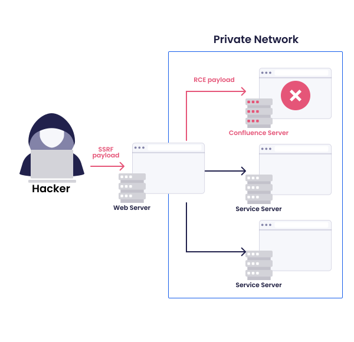

### Ejemplo de código vulnerable

**Javascript**

```javascript
const express = require('express');
const axios = require('axios');
const app = express();
const port = 3000;

//Actualizar imagen de perfil desde una URL externa
app.get('/user/change-profile-img', async function (req, res) {
  //Se obtiene la URL pasada por el body de la petición
  const imgUrl = req.body.imgUrl;
  //Realizamos un get a dicha URL sin validación previa
  const imageReq = await axios.get(imgUrl);
  //Actualizamos la imagen de perfil
  user.updateProfileImage(imageReq.data);
  res.send(imageReq.data);
});
```

### Prevención

El principal medio de mitigación es **permitir únicamente el acceso de salida a servidores externos y de confianza**. Nunca se debe de permitir el acceso a redes `10.0.0.0` o `192.168.0.0`, por ejemplo.

Para este tipo de mitigaciones es necesario tener en cuenta:
* No hacer comprobación por dominio, si no por IP.
* Validar posibles redirecciones.
* Tener cuidado con el DNS rebinding.

Dado que validar estas direcciones es una tarea compleja, existen unas contramedidas a valorar antes de pasar a implementarla:
* Evaluar la necesidad de solicitudes dinámicas donde el usuario establece el dominio.
* Utilizar una allow-list donde establecer un conjunto finito de servidores/dominios que permitir.

### Referencias

[Server-side request forgery (SSRF)](https://portswigger.net/web-security/ssrf)

[Server-side request forgery - OWASP](https://owasp.org/www-community/attacks/Server_Side_Request_Forgery)

# Otras categorias importantes

## Cross-Site Request Forgery

El **Cross-Site Request Forgery (CSRF)** (en español "falsificación de petición en sitios cruzados") es una vulnerabilidad web que fuerza al navegador de la victima, a realizar una petición no deseada a la aplicación vulnerable.

Esto permite que una acción sea llevada a cabo por un atacante en nombre de la victima y sea procesado por la aplicación web como una acción válida mas. 

Este tipo de ataques buscan que un usuario victima, completamente validado para hacer una acción, ejecute una acción indeseada por el propio usuario. Un ejemplo podría ser ejecutar una transferencia bancaria al atacante.

El proceso para efectuar el ataque se divide en 3 pasos fundamentales:
* El atacante consigue que la víctima acceda a un sitio web malicioso
* El sitio web sirve a la victima un sitio falso que apunta al recurso vulnerable del sitio web (por ejemplo, realizar una transferencia bancaria), del cual no necesita en muchos casos iteracción del usuario.
* Por último, la victima, de forma totalmente transparente para el, realiza una petición al recurso del sitio web vulnerable en el que estaba previamente autenticado para realizar la acción deseada por el atacante.

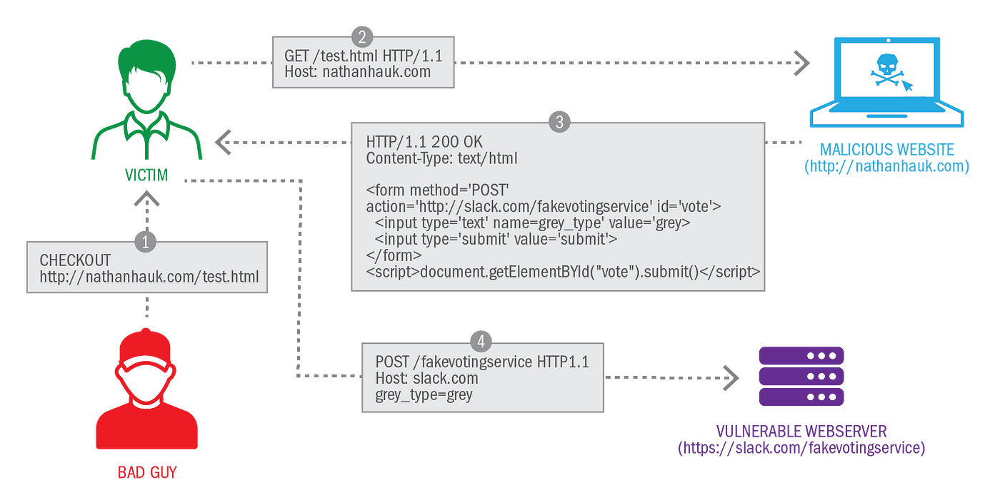

### Detección

### Ejemplo de código vulnerable

> [!WARNING] 
> En este caso no existe un código vulnerable como tal, simplemente existe la ausencia de protecciones (descritas más abajo). El pedazo de código descrito a continuación muestra el código definido en la web maliciosa del atacante, que redirige a la vulnerable.

```html
<html>
    <body>
        <form action="https://sitio-malicioso.com/transfer" method="POST">
            <input type="hidden" name="amount" value="500"/>
            <input type="hidden" name="account" value="654585ABC" />
        </form>
        <script>
            document.forms[0].submit();
        </script>
    </body>
</html>
```

### Prevención

La forma más robusta para defendernos de ataques CSRF es el uso de tokens CSRF dentro de las solicitudes web. 

#### Tokens anti-CSRF

Los tokens anti-CSRF deben de cumplir ciertas características para que permitan prevenir estos ataques:

* Impredecibles con alta entropia (similar a cookies de sesión)
* Vinculado a la sesión del usuario
* Debe de ser validado previamente a efectuar la acción pertinente

Este tipo de tokens deben de ser secretos, ya que de no serlo podrían ser accesibles por un atacante y manipulados para saltarse la medida defensiva. 

La forma más segura para enviar el token es que las aplicaciones transmitan los token CSRF dentro de un encabezado de solicitud personalizada. Esto presenta una defensa adicional contra un atacante que logra predecir o capturar la ficha de otro usuario, porque los navegadores normalmente no permiten que las cabeceras personalizadas se envíen cross-domain. 

Otro método, menos seguro pero escalable para cualquier tipo de aplicación, es transmitir el token al cliente dentro de un campo oculto del formulario HTML que se envia a través del POST.

```html
<input type="hidden" name="csrf-token" value={anti-csrf} />
```

Para una seguridad adicional, el campo que contiene el token CSRF debe colocarse lo antes posible dentro del documento HTML, idealmente antes de cualquier campo de entrada no oculto. Esto mitiga varias técnicas en las que un atacante puede utilizar datos elaborados para manipular el documento HTML y capturar partes de su contenido.

Finalmente, los tokens CSRF nunca deben enviarse como cookies.

Por parte del servidor, los tokens anti-CSRF deben de ser validados verificando que la solicitud incluye un token que coincide con el valor que se almacenó en la sesión del usuario. Esta validación debe realizarse independientemente del método HTTP o tipo de contenido de la solicitud. Si la solicitud no contiene ningún símbolo, debe rechazarse de la misma manera que cuando esté presente un token inválido.

#### Cookies Strict SameSite

Pese a que el método anterior solventa el problema, otro método para reducir el riesgo de la vulnerabilidad es establecer las cookies con la configuración `Strict SameSite`.

```
Set-Cookie: nombre=cookie; SameSite=Strict;
```

Dada esta configuración, las cookies sólo se crearán cuando el usuario esté en nuestra página navegando y la URL sea exactamente la misma para la que la cookie ha sido definida. Si el usuario accede a nuestra web desde un enlace externo, por ejemplo a través del email o de otra web, la cookie no saltará por no tratarse de una petición inicial lanzada desde nuestro dominio, por lo que no será posible utilizarla para autenticar la petición desde el sitio web malicioso al vulnerable.

### Referencias

[¿En qué consiste la vulnerabilidad Cross Site Request Forgery (CSRF)?](https://www.welivesecurity.com/la-es/2015/04/21/vulnerabilidad-cross-site-request-forgery-csrf/)

[Cross site request forgery (CSRF)](https://learn.snyk.io/lesson/csrf-attack/)

[Cómo prevenir las vulnerabilidades CSRF](https://portswigger.net/web-security/csrf/preventing)

[Set-Cookie](https://developer.mozilla.org/es/docs/Web/HTTP/Headers/Set-Cookie)

## XML External Entity attack

La **inyección XML External Entity (XXE)** es una vulnerabilidad web que permite a un atacante interferir en el normal funcionamiento del procesamiento de XMLs dentro de una aplicación.

Esta vulnerabilidad existe normalmente en aplicaciones que utilizan XML como formato de transferencia de información/datos entre servidor y navegador. Las vulnerabilidades XXE surgen porque la especificación XML contiene varias características potencialmente peligrosas, y los parsers estándar soportan estas características incluso si normalmente no son utilizados por la aplicación.

Las entidades externas XML son un tipo de entidad XML personalizada cuyos valores definidos se cargan desde fuera de la DTD en el que se declarany estas permiten definir una entidad basada en el contenido de una ruta de archivo o URL.

Habitualmente el objetivo de este tipo de ataques es interactuar con el servidor y obtener información del mismo, como ver archivos e interactuar con ellos, haciendo uso de estas entidades externas.


Los tipos de ataques que se pueden efectuar son:

* XXE para acceder a archivos: creando una entidad externa que referencia a un archivo, esperando su contenido. Para poder recibir el contenido desde el sistema de archivos del servidor, se debe de modificar el XML del siguiente modo:
  * Introducir o editar al elemento `DOCTYPE` que define una entidad externa con la ruta al archivo. 
  * Editar un valor en los datos del XML que devuelva la respuesta para hacer uso de la entidad externa.
  
```xml
<?xml version="1.0" encoding="UTF-8"?>
<!DOCTYPE foo [ <!ENTITY xxe SYSTEM "file:///etc/passwd"> ]>
<stockCheck><productId>&xxe;</productId></stockCheck>
```
  
* XXE efectuando ataques SSRF: creando una entidad externa que se define a una URL a un sistema de backend. Para poder llamar a la URL debemos añadir una entidad externa que hará una solicitud HTTP al backend a un sistema interno de la organización:
  
```xml
<!DOCTYPE foo [ <!ENTITY xxe SYSTEM "http://internal.vulnerable-website.com/"> ]>
```

* XXE para exfiltrar datos: enviando datos sensibles desde el servidor a un sistema que el atacante controla.

* XXE para detectar mensajes de error.

### Detección

Si una aplicación web permite el envio de datos navegador-servidor usando XML, es propenso a este tipo de ataques. Haciendo uso de proxies como ZAP o BurpSuite, podemos manipular las peticiones inyectando entidades externas introduciendo payloads para comprobar si el sitio web es vulnerable.

Existen otras herramientas que nos permiten probar la vulnerabilidad:

* XXEInjector
* XXExploiter

### Ejemplo de código vulnerable

```java
protected void doPost(HttpServletRequest request, HttpServletResponse response) throws ServletException, IOException {
    String xmlInput = request.getReader().readLine();

    //La clase DocumentBuilderFactory por defecto es vulnerable a XXE
    DocumentBuilderFactory factory = DocumentBuilderFactory.newInstance();

    DocumentBuilder builder = factory.newDocumentBuilder();
    Document document = builder.parse(new InputSource(new StringReader(xmlInput)));
    NodeList items = document.getElementsByTagName("item");

    if (items.getLength() == 0) {
        return;
    }

    Element item = (Element) items.item(0);
    String favourite = item.getTextContent();
    addToFavorites(favourite);
    response.getWriter().printf("Favourite %s saved", favourite);
}
```

### Prevención

Si eres vulnerable a este tipo de ataques es porque el parser que estás utilizando permite la interpretación de entidades externas y está habilitado en tu desarrollo.

Generalmente, la forma de resolver este tipo de vulnerabilidades pasa por utilizar parsers seguros y/o no permitir el uso de entidades externas y desactivar las propiedades inseguras de procesado de acceso externo (incluido el procesado del DTD).

```java
protected void doPost(HttpServletRequest request, HttpServletResponse response) throws ServletException, IOException {
    String xmlInput = request.getReader().readLine();

    DocumentBuilderFactory factory = DocumentBuilderFactory.newInstance();

    //Deshabilitamos la posibilidad de acceso via entidades externas
    factory.setFeature(XMLConstants.FEATURE_SECURE_PROCESSING, true);
    factory.setAttribute(XMLConstants.ACCESS_EXTERNAL_DTD, "");
    factory.setAttribute(XMLConstants.ACCESS_EXTERNAL_STYLESHEET, "");

    DocumentBuilder builder = factory.newDocumentBuilder();
    Document document = builder.parse(new InputSource(new StringReader(xmlInput)));
    NodeList items = document.getElementsByTagName("item");

    if (items.getLength() == 0) {
        return;
    }

    Element item = (Element) items.item(0);
    String favourite = item.getTextContent();
    addToFavorites(favourite);
    response.getWriter().printf("Favourite %s saved", favourite);
}
```

Otra opción pasa por utilizar otros lenguajes de transferencia de datos estructurales más modernos, como JSON.

### Referencias

[XML external entity (XXE) injection](https://portswigger.net/web-security/xxe)

[XML External Entity (XXE) Processing - OWASP](https://owasp.org/www-community/vulnerabilities/XML_External_Entity_(XXE)_Processing)

[XML external entity injection (XXE)](https://learn.snyk.io/lesson/xxe/)

## Insecure File Uploads (Local File Inclusion & Path Traversal)

Las **vulnerabilidades en la carga de archivos** permiten a un atacante subir archivos a la web sin una validación correcta, como el nombre, extensión, tamaño o contenido. No hacer una correcta restricción de estos elementos podría permitir subir ficheros potencialmente peligrosos que podrian llegar a causar una ejecución de código remoto en el servidor o introducir malware.

El impacto de este tipo de vulnerabilidades depende de diferentes factores: el archivo no se valida correctamente en su carga y/o no se ponen las restricciones correctas una vez se ha subido por completo.

En muchas ocasiones, este tipo de vulnerabilidades surgen porqye los desarrolladores no tienen en cuenta ciertas restricciones y validaciones a tomar. Por ejemplo, pueden crear una lista negra para tipos de archivos peligrosos, pero no tienen en cuenta las discrepancias al comprobar las extensiones de archivo, o el sitio web puede intentar comprobar el tipo de archivo verificando propiedades que pueden ser fácilmente manipuladas por un atacante usando herramientas como BurpSuite o ZAP.

### Detección

En el peor de los casos, el tipo del archivo no se valida correctamente, y la configuración del servidor permite ciertos tipos de archivos (como .php y .jsp) para ser ejecutado como código. En este caso, un atacante podría potencialmente subir un archivo de código del lado del servidor que funciona como una shell web, concediéndole el control total sobre el servidor.

Si el nombre de archivo no se valida correctamente, esto podría permitir a un atacante sobrescribir archivos críticos simplemente cargando un archivo con el mismo nombre. Si el servidor también es vulnerable a la traversal de directorios, esto podría significar que los atacantes pueden incluso subir archivos a lugares no previstos.

Si no se valida correctamente el tamaño del fichero podria provocarse un DoS y, en caso de no validarse el contenido podria introducirse malware o codigo interpretable para ser ejecutado a posteriori.

### Protecciones débiles

#### Listas negras de extensiones

Uno de los métodos más usados es usar listas negras para las extensiones de archivos, pero no es la más correcta. Pese a que es una forma de restringir ciertas subidas de archivos, existen ciertas formas de saltarse estes filtros:
* Encontrar extensiones olvidadas que se pueden ejecutar en el lado del servidor: `.php5`, `.swf`, `.shtml`...
* Encontrar fallos de configuración cuando el servidor analiza archivos con dobles extensiones o las ejecuta proporcionando un extensión después de un delimitador:
  * Ejemplo: En Apache, un archivo php podría ser ejecutado usando el doble técnica de extensión como `shell.php.jpg`
* Cambiando extensiones a mayúsculas: `shell.PHp3`
* Uso de caracteres de control como carácter nulo (0x00) después de un extensión prohibida

#### Listas blancas de extensiones

Pese que aparentemente es un método menos peligroso, comparte ciertos riesgos con las listas negras:
* La lista de extensiones debe de revisarse independientemente. Si se acepta por ejemplo la extensión `.shtml` se podría incurrir en un ataque SSI, el cual permite la explotación de una web aplicación inyectando scripts en páginas HTML o ejecutando arbitrariamente códigos de forma remota.
* Las técnicas de la doble extensión o transformación de caracteres en extensiones también son un riesgo en este tipo de casos.

#### Validación de la cabecera Content-Type

La entidad de Content-Type en la cabecera de la solicitud indica el tipo de contenido del mensaje, por lo que efectivamente podría ayudarnos a utilizar esta cabecera para reconocer un archivo como válido. Sin embargo, es posible eludir esta protección cambiando este parámetro en la cabecera de solicitud usando un proxy web, como BurpSuite o ZAP.

#### Usar un detector de tipo de archivo

A veces las aplicaciones web intencional o involuntariamente utilizan algunos funciones (o APIs) para comprobar los tipos de archivo con el fin de procesarlos de forma más segura. Así, cuando una aplicación redimensiona un archivo de imagen, puede sólo mostrar un mensaje de error cuando los archivos no son los esperados, antes de salvarlos en el servidor:
* Si se verifican los metadatos del fichero, podría insertarse el código malicioso después de la cabecera con los metadatos.
* Insertar código en las secciones que no tienen el efecto en el archivo principal.
* Los datos insertados pueden ser ofuscados o codificados si la aplicación detecta un código malicioso utilizando patrones o firmas
* Archivo cargado se puede elaborar para crear un código malicioso en caso de estar comprimido por la aplicación

### Ejemplo de código vulnerable

```javascript
app.post("/avatars/upload", (req, res) => {
    let avatar = req.files.file;
    let filename = avatar.name;

    fs.writeFile(`static/avatars/${user_id}/${filename}`, avatar.data, (err) => {
        if (err)
            res.status(500).send('Error uploading avatar');
        else
            res.json({ URL: `static/avatars/${user_id}/${filename}` });
    });
});
```

### Recomendación

Algunos consejos para una buena validación y restricción de carga de ficheros son:
* Implementar allow-lists como primer punto de filtrado (ya vimos que no eran lo más adecuado, pero son mejores que las negras)
* Generar el nombre de fichero aleatoriamente a la hora de subirlo, de forma impredecible
* No delegar en el usuario establecer la ruta donde subirlo
* Los archivos cargados no deben ser de acceso público a menos que realmente sea necesario. Incluso entonces, trate de implementar la autorización adecuada para asegurar que sólo las personas adecuadas tengan acceso a ellos
* Usar librerias seguras para subir ficheros

Para el ejemplo propuesto, una mitigación posible sería:

```javascript
const allowedExtensions = ['png', 'jpg', 'gif'] //Definimos una lista blanca
const maxFileSizeInBytes = 10 * 1024 * 1024; //Definimos tamaño maximo: 10 MB

app.post("/avatars/upload", (req, res) => {
    let avatar = req.files.file;
    let extension = path.extname(avatar.name).substr(1)

    if (!allowedExtensions.includes(extension)) //Validamos que la extensión sea correcta
        return
    
    if (avatar.data.length > maxFileSizeInBytes) { //Validamos que el tamaño sea correcto
        return
    }

    //Generamos aleatoriamente un nombre para el fichero
    let filename = `${shortid.generate()}.${extension}`

    //Guardamos el fichero
    fs.writeFile(`static/avatars/${user_id}/${filename}`, avatar.data, (err) => {
        if (err)
            res.status(500).send('Error uploading avatar');
        else
            res.json({ URL: `static/avatars/${user_id}/${filename}` });
    });
});
```

#### Cabecera X-Content-Type-Options

Evita que el navegador interprete archivos como MIME diferentes al especificado en la cabecera `Content-Type`, protegiendo contra ataques como MIME sniffing.

```http
X-Content-Type-Options: nosniff
```

### Referencias

[Unrestricted File Upload](https://owasp.org/www-community/vulnerabilities/Unrestricted_File_Upload)

[Unrestricted File Upload - Snyk](https://learn.snyk.io/lesson/unrestricted-file-upload/)